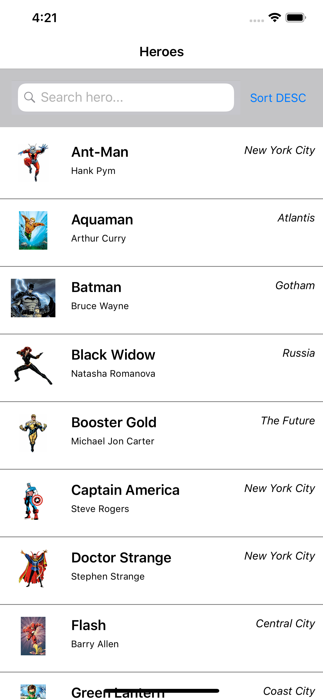

# SuperRolodex
A sample [Xamarin.Forms](https://docs.microsoft.com/en-us/xamarin/xamarin-forms/) app demonstrating [Couchbase](http://www.couchbase.com) Lite's N1QL and Full-Text Search functionality

<p >
  
  
</p>

## Couchbase Features

- [x] 	N1QL 
- [x] 	Full-Text Search (FTS)


## Setup 

Add the [Couchbase.Lite](https://info.couchbase.com/couchbase_server.html?utm_source=google&utm_medium=search&utm_campaign={campaign}&utm_keyword=couchbase%20lite&gclid=CjwKCAiAsoviBRAoEiwATm8OYLRKk9xyxqX6THVvQolI05aMeHJNKOJj1WkGxCee8o1b31NZUO0xnxoCEH4QAvD_BwE) [](https://www.nuget.org/packages/Couchbase.Lite/) nuget package to all platform (iOS/Android/UWP), and [.NET Standard projects](https://docs.microsoft.com/en-us/dotnet/standard/net-standard).

### Initialization

iOS: Add the following to AppDelegate.FinishLaunching:
```c#
Couchbase.Lite.Support.iOS.Activate();
```

Android: Add the following to MainActivity.cs:
```c#
Couchbase.Lite.Support.Droid.Activate();
```

### Sample Couchbase integrations

Retrieving a database (will create a new database if it doesn't exist)
```c#
var database = new Database("Heroes");
```

Adding a document to the database:
```c#
public string AddHero(Hero hero)
{
    // Create a new document (i.e. a record) in the database
    string id = null;

    using (var mutableDoc = new MutableDocument())
    {
        mutableDoc
            .SetString("HeroId", hero.HeroId)
            .SetString("ImageUrl", hero.ImageUrl)
            .SetString("Alias", hero.Alias)
            .SetString("Name", hero.Name)
            .SetInt("Age", hero.Age)
            .SetString("Location", hero.Location);

        // Save it to the database
        HeroesDatabase.Save(mutableDoc);

        id = mutableDoc.Id;
    }

    return id;
}
```

Create a query to retrieve all documents within a database, and sort accordingly.
```c#
var query = QueryBuilder.Select(SelectResult.All())
                                            .From(DataSource.Database(HeroesDatabase))
                                            .OrderBy(sortAscending ? Ordering.Property("Alias").Ascending() 
                                                                    : Ordering.Property("Alias").Descending())
```


Implement Full-Text Search (FTS)

Step 1.) Create an index.
```c#
var index = IndexBuilder.FullTextIndex(FullTextIndexItem.Property("Alias")).IgnoreAccents(false);
            HeroesDatabase.CreateIndex("AliasIndex", index);
```

Step 2.) Create a query to search, utilizing the previously created index.
```c#
var query = QueryBuilder.Select(SelectResult.All())
                                            .From(DataSource.Database(HeroesDatabase))
                                            .Where(whereClause)
                                            .OrderBy(sortAscending ? Ordering.Property("Alias").Ascending()
                                                                    : Ordering.Property("Alias").Descending())
```
